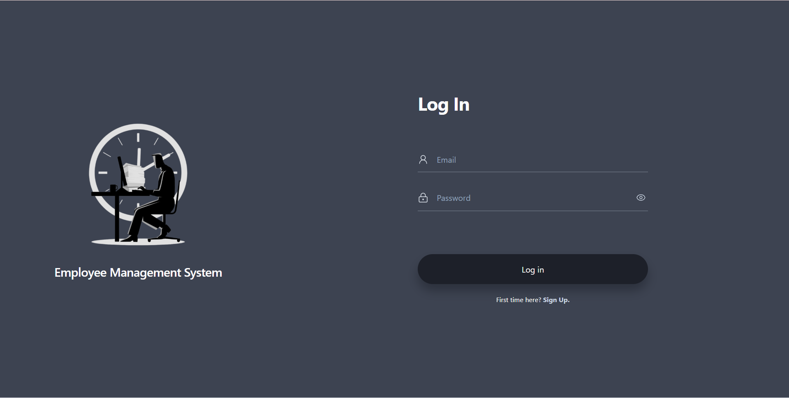
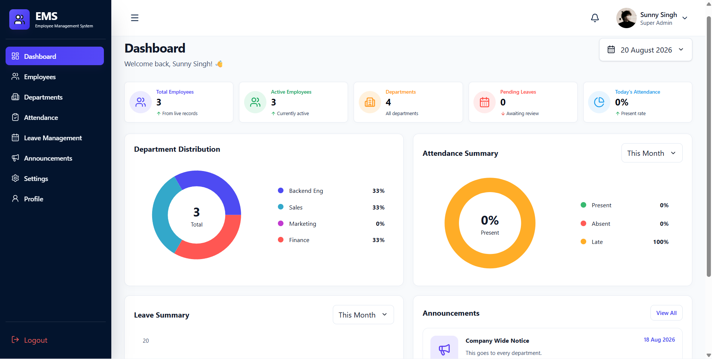
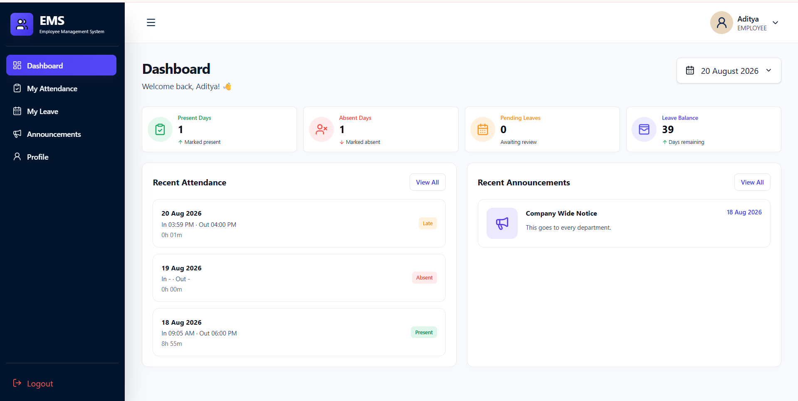
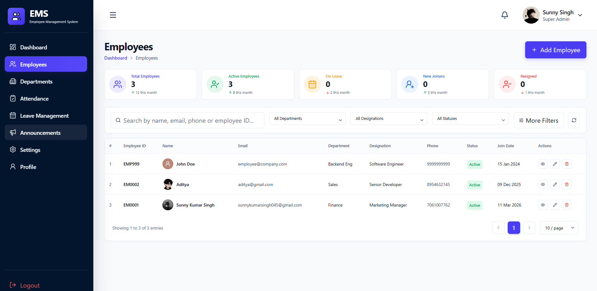
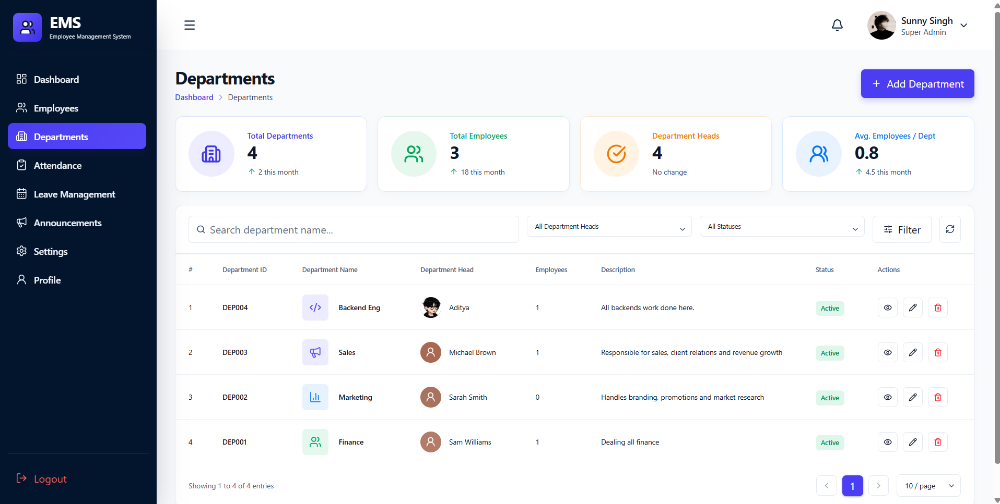
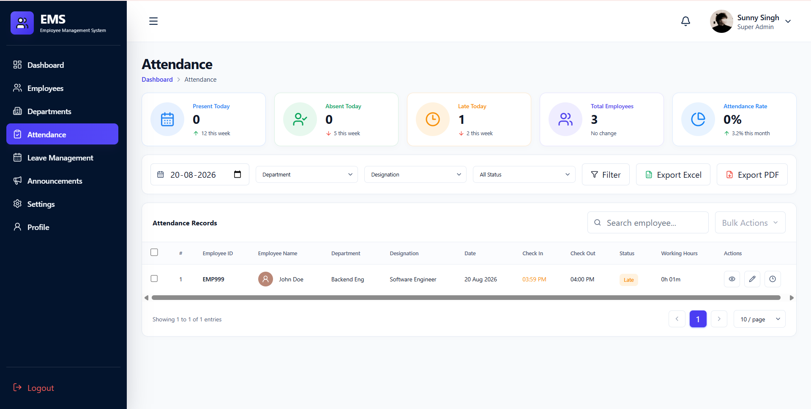
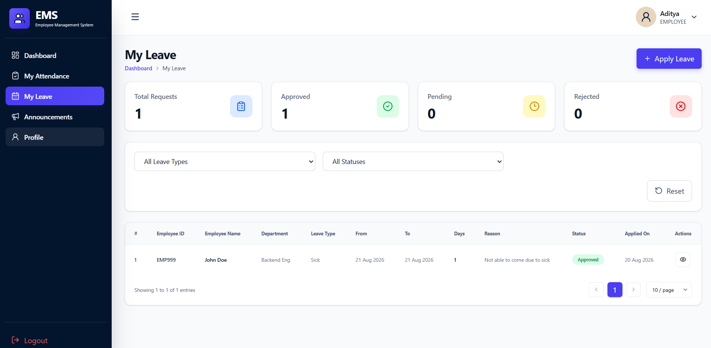
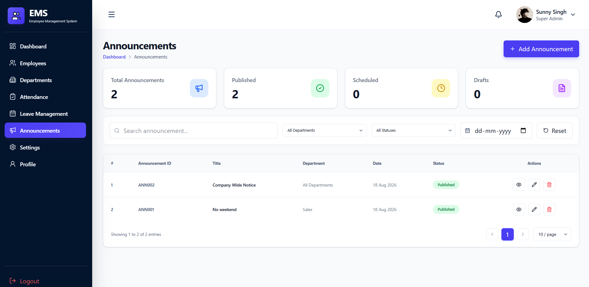

<div align="center">

# Employee Management System

A modern **Full Stack Employee Management System** built with **React, Spring Boot, Spring Security, JWT & MySQL** featuring secure authentication, role-based access, attendance, leave, departments, announcements, and employee management.


</div>

---

## ✨ Features

### 👨‍💼 ADMIN
- Dashboard & Analytics
- Employee Management
- Department Management
- Attendance Management
- Leave Approval System
- Announcements
- Role-Based Access

### 👨‍💻 EMPLOYEE
- Dashboard
- Check-In / Check-Out
- Attendance History
- Apply Leave
- Leave History
- Announcements
- Profile Management

---

## 🛠 TECH STACK

| Frontend | Backend | Database |
|----------|---------|----------|
| React.js | Spring Boot | MySQL |
| Vite | Spring Security | JPA/Hibernate |
| Axios | JWT Authentication | |
| React Router | Maven | |

---

## 🔐 AUTHENTICATION

- JWT Authentication
- Spring Security
- BCrypt Password Encryption
- Protected Routes
- Role-Based Authorization (ADMIN / EMPLOYEE)

---

## 📂 PROJECT STRUCTURE

```text
=======
Employee-Management-System/
│
├── backend/
│
├── frontend/
│   ├── public/
│   ├── src/
│   ├── package.json
│   ├── package-lock.json
│   ├── vite.config.js
│   ├── eslint.config.js
│   └── index.html
│
├── assets/
│   ├── banner.png
│   ├── login.png
│   ├── admin-dashboard.png
│   ├── employee-dashboard.png
│   ├── employees.png
│   ├── departments.png
│   ├── attendance.png
│   ├── leaves.png
│   └── announcements.png
│
├── README.md
└── .gitignore
```

---

## 🚀 Quick Start

### Clone

```bash
git clone https://github.com/sunnykumar-singh/employee-management-system.git
```

### Backend

```bash
cd backend
./mvnw spring-boot:run
```

### Frontend

```bash
cd frontend
npm install
npm run dev
```

---

## 👤 Demo Accounts

| Role | Email | Password |
|------|-------|----------|
| Admin | admin@company.com | Admin@123 |
| Employee | employee@company.com | Employee@123 |

---

## 📸 Preview

<<<<<<< HEAD
> Add screenshots here

- Login
- Admin Dashboard
- Employee Dashboard
- Attendance
- Leave
- Departments
- Announcements
=======









>>>>>>> 5b287a4 (docs: update README and reorganize project structure)

---

## 📌 Roadmap

- Payroll Module
- Email Notifications
- Reports & Analytics
- Docker Deployment
- Cloud Deployment

---

<div align="center">

### 👨‍💻 Developer

**Sunny Kumar Singh**

[](https://github.com/sunnykumar-singh)
[](https://www.linkedin.com/in/sunnykumarsingh045/)
[](mailto:sunnykumarsingh045@gmail.com)

⭐ **If you found this project helpful, consider giving it a star!**

</div>
